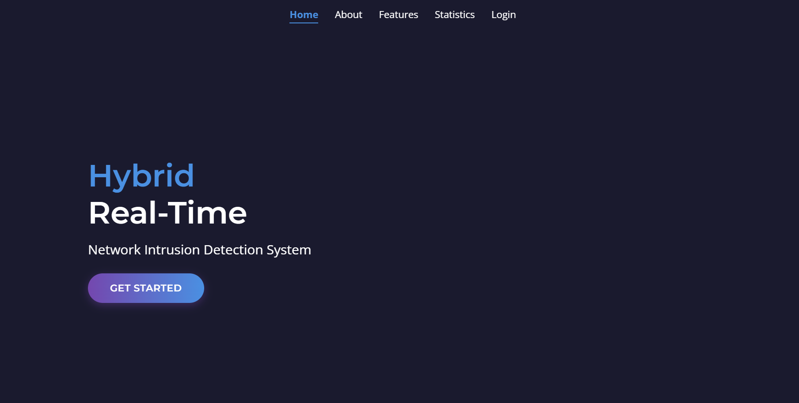
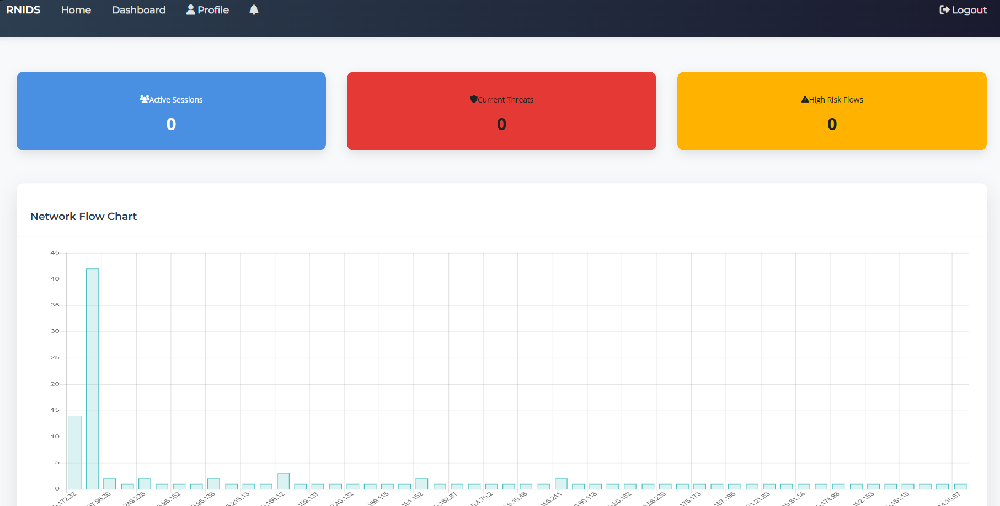
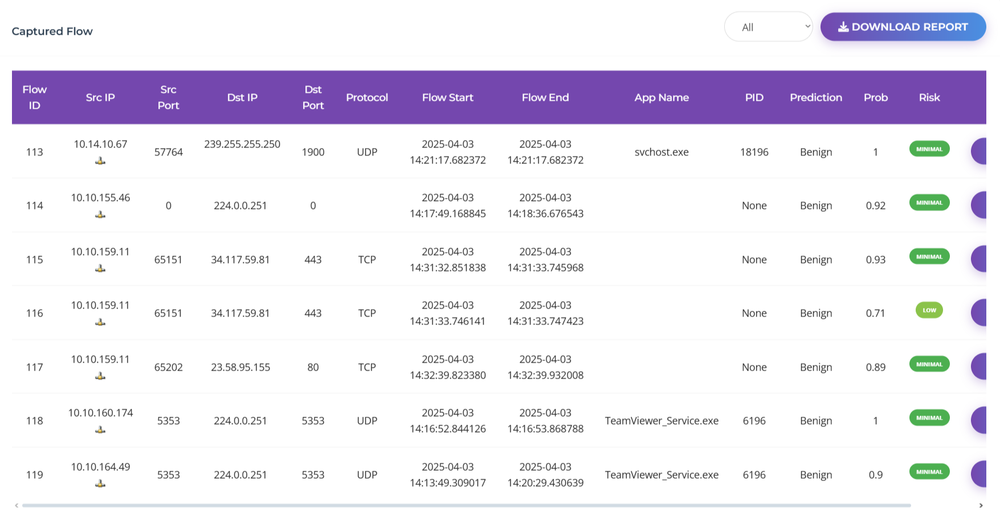
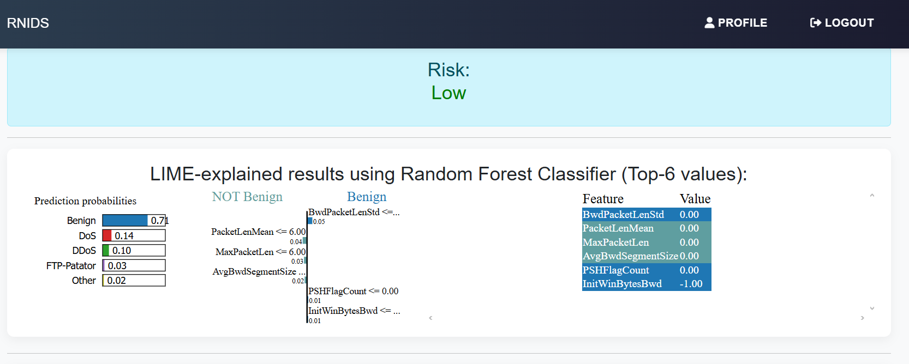
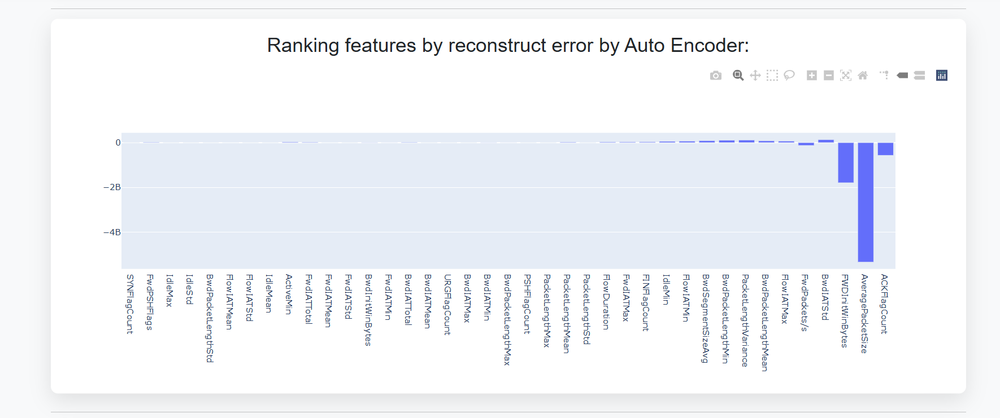

# 🛡️ Real-time Network Intrusion Detection System (RNIDS)

*A hybrid ML-powered security solution for identifying network threats in real-time.*

[](https://www.python.org/downloads/)
[](https://opensource.org/licenses/MIT)
[](https://flask.palletsprojects.com/)
[](https://firebase.google.com/)

---

## 🔍 Overview

**RNIDS** is an intelligent cybersecurity system that leverages machine learning and real-time monitoring to detect and classify malicious network activity. Developed as a final-year B.Tech project, RNIDS delivers enterprise-grade threat detection with explainable AI insights.

---

## 🎯 Problem Statement

Modern networks are increasingly vulnerable to sophisticated, zero-day attacks that evade traditional, signature-based intrusion detection systems (IDS).

### ⚠️ Key Challenges:
- Real-time detection of unknown (zero-day) threats  
- High false-positive rates in traditional systems  
- Lack of interpretability in AI-driven decisions  
- Need for scalable, cloud-integrated monitoring solutions  

---

## 💡 Our Solution: RNIDS

A hybrid approach combining:

- **🧠 Unsupervised Learning**: Autoencoders to detect unknown anomalies
- **🌳 Supervised Learning**: Random Forest classifiers for attack classification
- **📊 Risk Assessment**: Five-tier severity scoring system
- **🔍 Explainability**: LIME-based model interpretability

---
## 🎯 Objectives

- Detect and classify both known and unknown (zero-day) cyber threats.
- Provide explainable AI  insights using LIME.
- Enable real-time monitoring with actionable alerts.
- Support adaptive learning and secure web-based dashboards.

---

## 💡 Key Features

### 🧠 ML-Based Threat Detection
- **Random Forest Classifier**: For known threats (DoS, DDoS, brute-force, etc.)
- **Stacked Autoencoder**: For detecting novel and zero-day anomalies.
- **Hybrid Workflow**: Packet ➜ Flow ➜ Feature ➜ Detect ➜ Classify ➜ Alert

### 📈 Real-Time Visualization
- Live dashboards using Flask-SocketIO, Chart.js, and Plotly
- Interactive detail pages with per-flow LIME explanations
- Color-coded risk levels: Minimal to Very High

### 🛡️ Security
- JWT-based user authentication
- Secure session management
- Role-based access ready (future extension)

### 📋 Reporting
- CSV report export
- Risk-based filtering
- Real-time + historical traffic analytics

---

## 🧰 Tech Stack

- **Backend**: Python, Flask, Flask-SocketIO
- **ML**: Scikit-learn, TensorFlow/Keras, Autoencoder, Random Forest
- **Data Handling**: Pandas, NumPy, Scapy
- **Visualization**: Plotly, Chart.js, LIME
- **Database**: Firebase Firestore
- **Frontend**: Bootstrap 5

---

## 📂 Dataset Information

The models in RNIDS are trained using two benchmark datasets:

- **CIC-IDS 2018** (for supervised learning):  
  Includes labeled traffic such as DoS, DDoS, brute-force, botnets, and web attacks.  
  🔗 [CICIDS2018 Dataset](https://www.unb.ca/cic/datasets/ids-2018.html)

- **SVIC-APT 2021** (for unsupervised learning):  
  Provides benign traffic and advanced persistent threat patterns such as Pivoting, Lateral Movement, Data Exfiltration.  
  *(Add link if publicly hosted)*

The datasets are preprocessed using:
- MinMax scaling
- One-hot encoding for protocol features
- Recursive Feature Elimination (RFE) for feature selection

---


## 🏆 Project Significance

- **Dual-Model Approach**: Fuses unsupervised and supervised ML for robust detection  
- **Explainable AI**: Enables human-understandable security decisions  
- **Real-Time Analysis**: Processes packets in under 100ms  
- **Scalable & Production-Ready**: Designed with persistent cloud storage and user management  

---

## 🚀 Getting Started

```bash
# Clone the repo
git clone https://github.com/your-username/rnids.git

# Create virtual environment
python -m venv venv
source venv/bin/activate  # or venv\Scripts\activate on Windows

# Install dependencies
pip install -r requirements.txt

# Start the Flask server
python application.py
```

###  MainPage Preview


###  Dashboard Preview


###  Flow Analysis Example


###  Detail Page


###  Explainable AI

